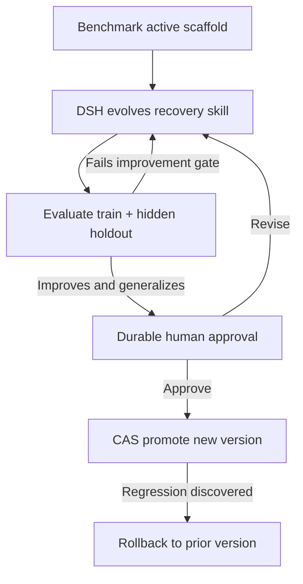

# DSH Recursive Self-Improvement Supervisor

A runnable MVP in which **DeepSeek Harness improves the agent's own
failure-recovery scaffold**, proves the improvement on a held-out benchmark,
then promotes or rolls back the resulting version through a durable LoopGraph.

**[Open the hosted interactive interview replay](https://zzzjw611.github.io/dsh-rsi-supervisor/)**

The hosted page is intentionally a deterministic, browser-persisted replay: it
lets reviewers operate the complete seven-step control-plane story immediately,
without credentials or a shared mutable backend. It is labeled as such in the
UI. The runnable Python application below executes the same flow through the
real supervisor, SQLite journal, subprocess verifier, and optional DSH adapter.

The model is frozen. The supervisor is frozen. The evaluator is frozen. The only
thing allowed to evolve is an explicit, versioned recovery skill:

```python
def choose_next_action(trace: dict) -> str:
    ...
```

That distinction matters: **retrying a task is not recursive self-improvement**.
Improving the mechanism that will handle future tasks is.

## Run the demo in one command

```bash
make demo
```

To present the same experiment as an interactive, zero-dependency control plane:

```bash
make dashboard
# Open http://127.0.0.1:8787
```

The dashboard shows the frozen/evolving trust boundary, current graph node,
baseline and hidden-holdout scores, every durable event, the actual scaffold
diff, and the active native DSH skill. Start a replay experiment, advance one
step or run until review, approve the release, probe a fresh permission failure,
then roll the release back. Refreshing the page reconstructs the view entirely
from durable SQLite state; it does not depend on browser-local workflow state.

### Three-minute guided walkthrough

The dashboard opens an interactive walkthrough automatically. Its animated
highlight follows the next real action; the **Next: ...** button scrolls to and
actually executes that action, then advances to the next durable state. Close
the walkthrough at any time or reopen it with **✦ Demo guide**.

1. **New experiment** establishes the 12.5% baseline.
2. **Advance one step** generates the first candidate.
3. **Advance one step** again scores and rejects it: 43.75% overall, 37.5% holdout.
4. **Run until review** evolves generation two to 100% and stops at human review.
5. **Approve & promote** explicitly activates the improved release.
6. **Evaluate live trace** turns a `403 Forbidden` failure into `request_human`.
7. **Rollback** restores the baseline; the same trace returns `inspect_context`.

Replay needs no API key, third-party package, frontend build, or internet access.

## Hosted walkthrough, container runtime, and GitHub automation

Every successful `main` CI run publishes the same packaged dashboard assets to
GitHub Pages. The Pages runtime replaces REST calls with an isolated browser
state machine, so a reviewer can safely demonstrate candidate generation,
holdout rejection, pause/resume, HITL approval, promotion, capability probing,
and rollback. Replay state is stored only in that reviewer's browser.

GitHub Pages does **not** run Python, DSH, or the SQLite supervisor. This boundary
is deliberate and visible in the UI; the hosted walkthrough is presentation
evidence, while the following container is the executable systems evidence.

Run the same dashboard in a portable container with a persistent SQLite volume:

```bash
docker compose up --build
# Open http://127.0.0.1:8787
```

The container listens on `0.0.0.0:$PORT`; its SQLite journal, release history,
and projected DSH skill live below `/data`. Mount a durable volume at `/data` on
your hosting provider. Without that volume, deployment and container replacement
would discard the very recovery history the assignment is intended to preserve.

GitHub Actions runs the full test suite and builds the deployment container on
every push. Only after CI succeeds does the Pages workflow publish the hosted
replay. It needs no deploy webhook, hosting account, API key, or payment method.
The deployed release SHA is exposed at `release.txt` for traceability.

The bundled demo server has no authentication. Keep public deployments in replay
mode and do not configure `DEEPSEEK_API_KEY` on an internet-accessible instance
without adding access controls; otherwise a visitor could initiate billed model
calls. Production deployments need separate authentication and authorization.

The deterministic replay needs only Python 3.11+ and exercises the same durable
supervisor, verifier, HITL gate, version registry, and rollback path as live DSH.

Actual replay result:

| Scaffold | Overall benchmark | Hidden holdout | Decision |
|---|---:|---:|---|
| Seed / active baseline | 2 / 16 = 12.5% | 12.5% | Establish version `v0` |
| Generation 1 | 7 / 16 = 43.75% | 37.5% | Reject: holdout gate failed |
| Generation 2 | 16 / 16 = 100% | 100% | Human approval, then promote |

This is a measured **+87.5 percentage-point capability improvement** in the
persisted scaffold. The first candidate really improves on the baseline, but is
still rejected because improvement without generalization is insufficient.

The promoted policy is also installed in the native DSH project-skill location,
`.dsh/skills/loopgraph-failure-recovery/SKILL.md`. A skill-enabled Harness
composition can discover the improved instructions; rollback restores the old
skill. The minimal/default Python SDK composition does not guarantee that skill
plugins are enabled, so materialization and actual runtime discovery are reported
as separate facts.

## Run against real DeepSeek Harness

```bash
python -m venv .venv
source .venv/bin/activate
python -m pip install -e '.[dsh]'

# Configure this in your own terminal. Never paste an API key into chat.
export DEEPSEEK_API_KEY="..."

# Report SDK, provider, model, credentials, and skill-composition readiness.
loopgraph dsh-doctor

# Optional: make one actual DeepSeek Harness/model call and print its session ID.
loopgraph dsh-doctor --probe

# Run the complete model-generated evolution and independent benchmark.
loopgraph --db .loopgraph/live.db rsi-demo \
  --mode dsh \
  --workspace . \
  --auto-approve \
  --reset
```

In `--mode dsh`, the candidate source is actually generated through the official
[DeepSeek Harness Python SDK](https://github.com/deepseek-ai/deepseek-harness/blob/master/docs/user/guide/python-sdk.md).
Replay is explicitly labeled `replay`; it never pretends to have called a model.
The dashboard also exposes a live DSH mode, but refuses to start it until both
the official SDK and `DEEPSEEK_API_KEY` exist in its server environment. No other
provider's credential is accepted as a substitute.

The official SDK guide describes a minimal composition that omits skills. To
have a DSH session actually discover the projected `SKILL.md`, supply a Cordis
composition that enables the DSH skill subsystem and point the adapter at it:

```bash
export DSH_CORDIS=/absolute/path/to/skill-enabled.cordis.yml
loopgraph dsh-doctor
```

The composition needs the skill, filesystem skill provider, and skill-tool
plugins. See the official
[Python SDK composition documentation](https://github.com/deepseek-ai/deepseek-harness/blob/master/docs/user/guide/python-sdk.md)
and [skill subsystem documentation](https://github.com/deepseek-ai/deepseek-harness/blob/master/docs/subsystems/skills.md).

Omit `--auto-approve` to stop at the durable human-review gate:

```bash
loopgraph --db .loopgraph/live.db rsi-demo --mode dsh --reset
loopgraph --db .loopgraph/live.db decide RUN_ID approve --feedback "Reviewed"
loopgraph --db .loopgraph/live.db drive RUN_ID
```

## What actually improves

The baseline skill handles unknown failures but has no useful recovery policy:

```python
def choose_next_action(trace: dict) -> str:
    return "inspect_context"
```

The evolver sees the current scaffold, failed training traces, and verifier
feedback. It proposes an improved skill capable of distinguishing:

- missing dependencies → inspect the dependency;
- failed assertions → inspect the tests;
- permission failures → ask a human;
- timeouts → reduce scope;
- model throttling → back off;
- repeated failure → roll back;
- successful execution → finish.

Eight hidden holdout cases use different wording and are not included in the DSH
evolver prompt. Promotion requires both improvement over the active baseline
and a minimum holdout score.

Inspect the actual persisted change:

```bash
loopgraph --db .loopgraph/live.db rsi-diff RUN_ID
loopgraph --db .loopgraph/live.db rsi-report RUN_ID
loopgraph --db .loopgraph/live.db events RUN_ID

# Prove the promoted scaffold now changes behavior on a new execution trace.
loopgraph --db .loopgraph/live.db rsi-act \
  --error "403 Forbidden: deployment policy denied access"

# Inspect the skill available to a skill-enabled DSH composition.
sed -n '1,80p' .dsh/skills/loopgraph-failure-recovery/SKILL.md

# Rebuild the native skill if its filesystem projection is ever removed.
loopgraph --db .loopgraph/live.db rsi-export-skill --workspace .
```

## Governed RSI loop



The evolver is bounded:

1. Only `choose_next_action` is an accepted editable surface.
2. Generated Python is AST-validated: no imports, filesystem calls, dynamic
   execution, classes, or unrelated functions.
3. Candidate evaluation runs in an isolated Python subprocess with a timeout.
4. Holdout answers never appear in the evolver prompt or revision feedback.
5. The candidate cannot change its own verifier, promotion policy, or model.
6. The human gate, release pointer, and event history remain outside the agent.

The subprocess is process isolation, not a hardened hostile-code sandbox. DSH's
own tool permissions should be configured separately for production use. Holdout
cases are withheld from prompts and feedback, but an unrestricted DSH session
could still inspect this open-source repository; a production evaluator should
keep private fixtures outside the agent's filesystem boundary.

## Why this shows more than a retry loop

| Capability | Concrete evidence in the demo |
|---|---|
| Real self-improvement | A persistent recovery policy changes and scores improve on future cases |
| DSH-first | Official DSH SDK can evolve a real native project skill; composition readiness is explicit |
| Harness-neutral | The supervisor sees only `HarnessAdapter`; replay and JSON CLI are alternatives |
| Benchmark discipline | Baseline, candidate score, hidden holdout, minimum gate, and no fake equal-score promotion |
| Governance | Frozen outer control plane, bounded editable surface, and durable HITL |
| Observability | Interactive dashboard, typed durable events, version lineage, benchmark evidence, REST, SSE, and source diff |
| Crash recovery | Started external calls resume as `recovery_required`, never silently replayed |
| Safe release | Immutable candidates, compare-and-swap promotion, and prior-version rollback |

## Inspect lifecycle and rollback

```bash
loopgraph --db .loopgraph/live.db status RUN_ID
loopgraph --db .loopgraph/live.db pause RUN_ID
loopgraph --db .loopgraph/live.db resume RUN_ID
loopgraph --db .loopgraph/live.db verify-journal RUN_ID
loopgraph --db .loopgraph/live.db rollback RUN_ID
```

Or demonstrate promotion followed by rollback in one run:

```bash
PYTHONPATH=src python -m loopgraph.cli --db /tmp/rsi.db rsi-demo \
  --mode replay --auto-approve --rollback-after-promotion --reset
```

## Core architecture

```text
CLI / interactive dashboard / REST / SSE
        |
Durable LoopGraph supervisor
        |
        +-- DSH / replay / generic JSON harness adapter
        +-- guarded scaffold evolution
        +-- train + holdout benchmark verifier
        +-- SQLite event log + checkpoints + worker leases
        +-- immutable versions + CAS promotion + rollback history
```

Every state transition commits its events, materialized run state, checkpoint,
and any candidate/release changes in the same SQLite transaction.

The DSH `SKILL.md` file is an atomically replaced **projection** of the active
SQLite version, not a second source of release truth. If a process dies after
promotion but before writing the skill, `rsi-export-skill` rebuilds it exactly
from the durable active version.

External agent calls cannot share that transaction. The supervisor first commits
`agent.started` with an idempotency key, then commits the result afterward. If a
process dies in between, the replacement worker enters `recovery_required` and
requires an explicit `retry` or `abort`. It does not make an impossible
"exactly-once side effects" claim.

For design details, see [architecture](docs/architecture.md),
[RSI design](docs/rsi-design.md), and
[failure semantics](docs/failure-semantics.md).

## Run tests

```bash
make lint
make test
```

Coverage includes measured scaffold improvement, hidden-holdout rejection,
equal-score rejection, DSH contract, fenced-code normalization, AST safety,
human approval, restart recovery, safe-boundary pause, stale promotion,
rollback, event tampering, credential-redaction guarantees, packaged dashboard
assets, and the complete dashboard approval/probe/rollback lifecycle.

## HTTP observation

```bash
loopgraph serve --host 127.0.0.1 --port 8787
```

`GET /` serves the bundled dashboard. `GET /api/rsi/environment` exposes only
credential presence, never credential values; `GET /api/rsi/runs` restores
persisted experiments. `POST /api/rsi/runs` creates an experiment and
`POST /api/rsi/runs/{id}/{step,run,approve,pause,resume,rollback,probe}` drives
the governed control plane.

`GET /runs/{id}`, `GET /runs/{id}/events`, and
`GET /runs/{id}/events/stream` expose state and live events. Lifecycle controls
are available through `POST /runs/{id}/{drive,pause,resume,decisions,rollback}`.
The bundled server intentionally binds to loopback and does not implement
authentication.

## Repository layout

```text
src/loopgraph/rsi.py         scaffold evolution, benchmark, safety, reporting
src/loopgraph/dashboard.py   safe live-readiness checks and durable UI snapshots
src/loopgraph/static/        self-contained interactive control plane
src/loopgraph/supervisor.py  durable graph execution and HITL
src/loopgraph/storage.py     SQLite journal, checkpoints, leases, release CAS
src/loopgraph/adapters/dsh.py
tests/test_rsi.py            measured improvement and governance tests
tests/test_dashboard.py      visual-control-plane lifecycle and credential tests
docs/rsi-design.md           scope, benchmark, boundaries, and demo narrative
```

MIT licensed.
