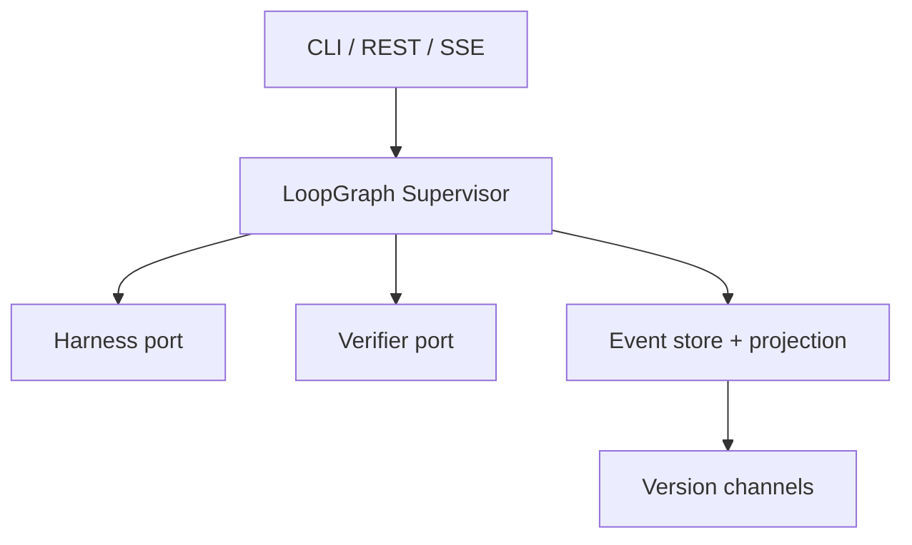
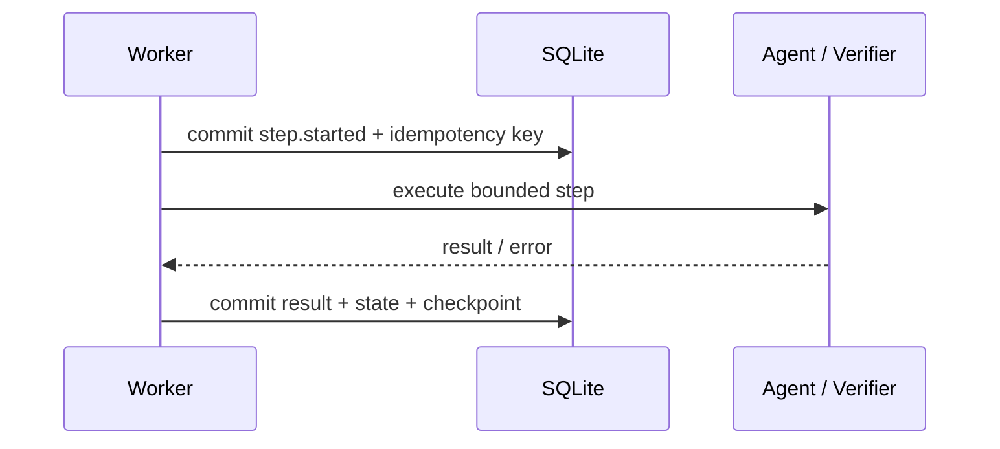

# Architecture

The primary product flow is the governed recursive self-improvement experiment
described in [RSI design](rsi-design.md). This document explains the durable
control plane underneath that experiment.

## Design goals

The core question is not how to write another model/tool loop. It is how to put
a durable, inspectable control plane around an existing loop without inheriting
the inner harness's lifecycle assumptions.

The implementation separates five concerns:

- **Supervisor:** deterministic routing and lifecycle policy.
- **Harness port:** one bounded agent execution. DSH is first-class.
- **Verifier port:** deterministic or domain-specific quality gates.
- **Repository:** events, checkpoints, leases, and rebuildable projections.
- **Version channels:** immutable candidates with optimistic promotion.

## Run state machine

Only persisted state decides what happens next. The agent cannot skip
verification, self-promote, or manufacture a human decision.

| State | Meaning | Valid exit |
|---|---|---|
| `running` | A worker may drive graph nodes | node transition, pause, terminal |
| `paused` | No new node may start | explicit resume |
| `awaiting_human` | A durable HITL decision is required | approve/revise/reject/rollback |
| `recovery_required` | A started external call has no committed result | retry/abort |
| `succeeded` | Candidate was atomically promoted | explicit rollback request |
| `rolled_back` | Channel pointer was restored | terminal |
| `failed` / `cancelled` | Terminal without promotion | terminal |

The graph and lifecycle status are separate on purpose. `current_node=verify`
and `status=paused`, for example, means verification is the next safe action but
no worker is permitted to start it.

## Write model

`events` is the immutable audit journal. `runs.state_json` is a query-optimized
projection. `checkpoints` can repair that projection after corruption or a
partial operational restore.

Each event stores:

- monotonically increasing per-run sequence;
- timestamp, type, graph node, and structured payload;
- optional idempotency key;
- previous event hash and current SHA-256 hash.

The hash chain is tamper-evident, not a signature. A privileged attacker able to
rewrite the entire database can recompute it; production deployments can anchor
tail hashes in an external transparency or audit system.

## External-call boundary

Agent and verifier calls are deliberately outside SQLite transactions:

If the worker stops before the final commit, the next worker sees a persisted
pending step owned by another worker and emits `recovery.required`. It does not
guess whether the external side effect happened.

For an adapter with a durable idempotency lookup API, a future extension can
reconcile the original key automatically. The conservative fallback remains
safe for DSH and arbitrary CLI harnesses.

## Scheduling and concurrency

- `BEGIN IMMEDIATE` serializes state transitions.
- A per-run lease prevents two workers from driving the same graph.
- A heartbeat extends the lease around slow external calls.
- Step completion validates both the step id and worker owner.
- Pause requests may update state during an external call; completion observes
  the request and enters `paused` at the next node boundary.
- Channel promotion is compare-and-swap against the run's base version. Two
  stale candidates cannot both overwrite the same release channel.

## Version model

An agent result creates an immutable candidate with:

- parent candidate/base version;
- iteration number;
- response, artifact reference, and adapter metadata;
- verifier result and evidence;
- lifecycle status.

Promotion atomically updates the candidate status, prior version status, channel
pointer, and append-only channel history. Rollback is another channel-history
entry rather than deletion. The previous artifact remains inspectable.

## DSH integration

`DeepSeekHarnessAdapter` uses `DeepSeekHarness.run()` and records the DSH session
identifier, finish reason, session root, and event counts. A graph step uses a
dedicated session derived from the durable step id.

The outer loop persists the goal, feedback, prior candidate, and release state.
Consequently, a process restart can start a new DSH step from durable context
without relying on in-memory Bash state or on a particular SDK version's
cold-session behavior. DSH-specific change is isolated to `adapters/dsh.py`.

## Extension points

1. Implement `HarnessAdapter.execute(AgentRequest) -> AgentResult`.
2. Implement `Verifier.verify(VerificationRequest) -> VerificationResult`.
3. Replace `SQLiteRepository` behind an equivalent transactional contract for
   distributed scheduling.
4. Subscribe to version events to integrate Git, a model registry, or a
   deployment system.
5. Add policy nodes to the explicit graph rather than hiding gates in prompts.
