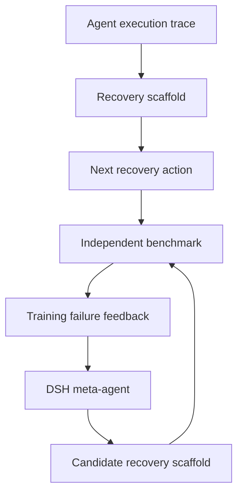

# Recursive self-improvement MVP

## Thesis

The minimum credible RSI demonstration is not "ask the model to retry until a
task passes." It is:

> A fixed agent uses evidence from its own failures to improve a durable
> component of its future behavior, and an independent evaluator proves that
> the new component performs better before it becomes active.

This project chooses the smallest useful improvement object: the recovery
policy that decides what an agent should do after a failure.

## Editable and frozen surfaces

| Surface | Mutable? | Why |
|---|---|---|
| Recovery function `choose_next_action` | Yes | This is the scaffold being improved |
| Current model and model weights | No | Improvement is scaffold-level, not fine-tuning |
| LoopGraph scheduler and state transitions | No | Governance must remain outside the evolver |
| Verifier and benchmark expected answers | No | The candidate cannot grade itself |
| Holdout answers | No | Promotion must check generalization |
| Promotion threshold and human decision | No | The candidate cannot self-authorize release |

## Example generations

```text
v0   score  2 / 16   holdout 1 / 8   baseline is active
v1   score  7 / 16   holdout 3 / 8   improvement, but rejected
v2   score 16 / 16   holdout 8 / 8   approved and promoted
```

This deliberate rejected intermediate is important: the release decision is not
"did a benchmark number go up?" It is "did the candidate improve and meet the
held-out reliability threshold?"

## Task and meta-task separation

The ordinary task executor observes a trace and chooses one recovery action.
The meta-agent receives the previous policy plus training failures and proposes
a new policy. These are different levels of work:



The holdout evaluator sees both training and hidden cases; the DSH meta-agent
receives only training examples and feedback.

This MVP enforces prompt-level holdout separation, not adversarial secrecy from
a Harness session configured with unrestricted repository access. Real private
evaluations belong outside the agent's filesystem and tool-permission boundary.

## Live mode versus deterministic replay

`--mode dsh` delegates candidate generation to
`deepseek_harness.DeepSeekHarness.run()`. This is the real integration and
requires the optional DSH SDK plus valid model credentials.

`--mode replay` supplies two deterministic candidate generations. It uses the
same:

- benchmark implementation;
- AST guard;
- subprocess execution;
- event-sourced supervisor;
- human review;
- immutable version storage;
- CAS promotion and rollback.

Replay makes the acceptance demo and CI reproducible. It is explicitly labeled
and never presented as a model-generated result.

## Promotion invariant

A candidate is eligible only if:

```text
candidate.overall_score > active_baseline.overall_score
AND candidate.holdout_score >= active_baseline.holdout_score
AND candidate.holdout_score >= configured_minimum_holdout
AND a human approves, unless approval was explicitly disabled
AND the active channel still matches the recorded baseline version
```

The last condition is compare-and-swap. Another run cannot silently change the
release base underneath this improvement.

## What makes the result durable

The candidate source itself is stored in an immutable version record, together
with its parent, source hash, verifier score, training failures, and holdout
aggregate. The model process may disappear entirely; the accepted scaffold and
its lineage survive in SQLite.

`rsi-act` loads the currently active version and applies it to a new execution
trace. The demo report also includes the same trace under both the baseline and
the active version, proving that promotion changes future behavior rather than
only changing a benchmark record.

Every active version is also materialized into DSH's highest-priority native
project skill root:

```text
.dsh/skills/loopgraph-failure-recovery/SKILL.md
```

The seed is materialized before the first DSH evolver session starts. Promotion
atomically replaces the file with the approved policy; rollback replaces it with
the restored one. Future DSH sessions can discover and consume the evolved
capability when their Cordis composition enables the skill subsystem, filesystem
skill provider, and skill tool. The minimal Python SDK composition can omit those
plugins: a file existing at the correct native path does not, by itself, prove
that a particular session loaded it. `loopgraph dsh-doctor` exposes whether a
custom composition was configured.

SQLite remains the sole release authority. The skill file is a rebuildable
projection because an external filesystem replacement cannot share SQLite's
commit transaction. `rsi-export-skill` repairs it after a crash or deletion.

Rollback moves the active pointer back to the exact previous scaffold. It does
not delete the candidate, its benchmark evidence, or its event history.

## Suggested three-minute walkthrough

1. Run `make dashboard` and open `http://127.0.0.1:8787`.
2. Create a replay experiment; point out which components stay frozen.
3. Advance generation one and show that hidden-holdout failure rejects it.
4. Run until review: generation two reaches 100%, but release is still blocked.
5. Approve the promotion and probe `403 Forbidden` to show changed behavior.
6. Inspect the durable event trace, real scaffold diff, and projected `SKILL.md`.
7. Roll back and show the same probe return to the original baseline behavior.
8. Run `loopgraph dsh-doctor --probe`, then select live DSH mode when an actual
   DeepSeek credential and the official SDK are available.
